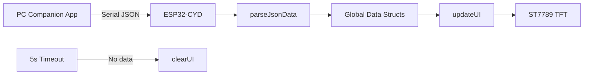
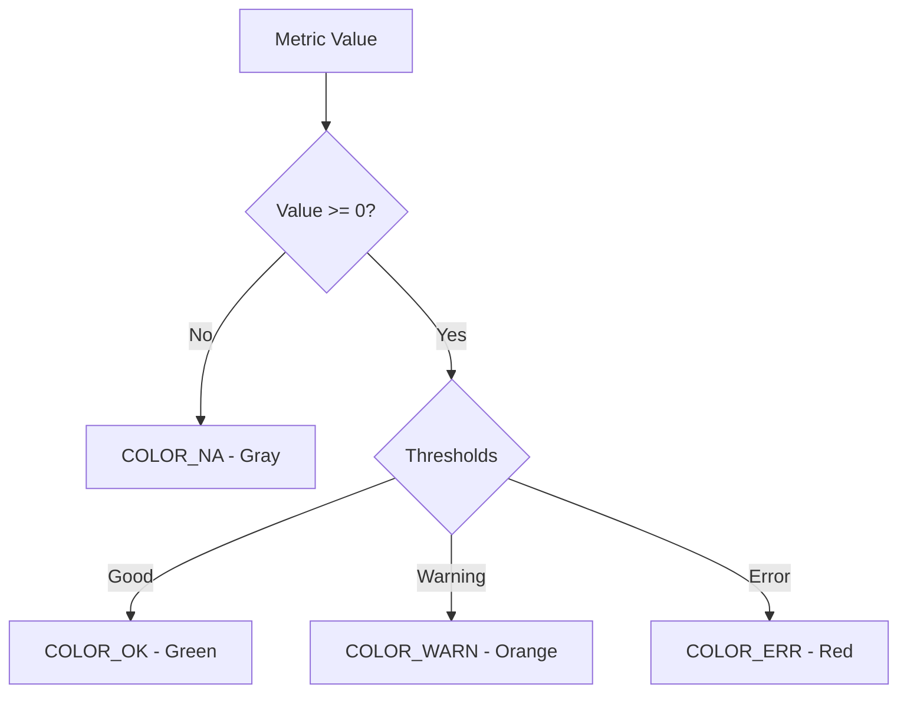
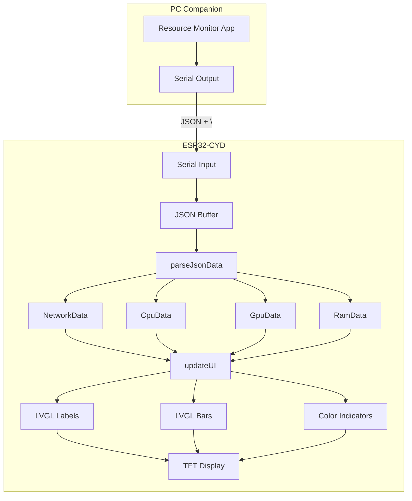
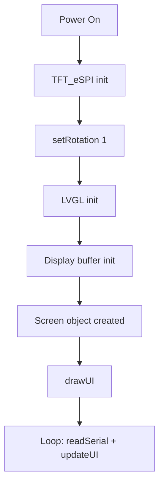

# ESP32-CYD-PC-Monitor-PoC Architecture

## Overview

ESP32-CYD (Cheap Yellow Display) proof-of-concept for displaying PC resource metrics received over Serial. The system parses JSON data from a companion PC application and renders a real-time dashboard using LVGL.

- **MCU:** ESP32-WROOM-32
- **Display:** 2.8" ST7789 TFT (320×240)
- **UI:** LVGL v8.4.0 with custom fonts
- **Communication:** Serial (115200 baud)
- **Status:** Proof-of-concept / snapshot

---

## Hardware Architecture

### Pinout

| Pin | Function |
|-----|----------|
| GPIO 15 | TFT_CS |
| GPIO 2  | TFT_DC |
| GPIO -1 | TFT_RST (connected to ESP32 RST) |
| GPIO 21 | TFT_LED (backlight PWM) |
| GPIO 13 | TFT_MOSI |
| GPIO 12 | TFT_MISO |
| GPIO 14 | TFT_SCLK |

### Display Configuration

- **Driver:** ST7789 (via TFT_eSPI)
- **SPI:** HSPI (`USE_HSPI_PORT` enabled)
- **Rotation:** 1 (landscape, 320×240)
- **Backlight:** PWM on GPIO 21, HIGH = ON
- **Color order:** TFT_BGR (defined in User_Setup.h)
- **Inversion:** TFT_INVERSION_ON (defined in User_Setup.h)

### Display vs AmbiSense Hardware

This PoC uses the **same CYD hardware** as AmbiSense (ESP32-2432S028), but with a different display driver configuration:

| Aspect | AmbiSense | PC Monitor PoC |
|--------|-----------|----------------|
| Display driver | ILI9341 | ST7789 |
| TFT_RST | GPIO 4 | -1 (tied to ESP32 RST) |
| TFT_LED | GPIO 14 | GPIO 21 |
| Rotation | 3 | 1 |
| Color order | TFT_BGR | TFT_BGR |
| Inversion | TFT_INVERSION_OFF | TFT_INVERSION_ON |

> **Note:** The CYD can use either ILI9341 or ST7789 driver depending on the specific variant. This PoC uses ST7789 with inversion enabled.

---

## Firmware Architecture

### Module Organization

**Main Controller** (`src/main.cpp`)
- Hardware initialization (TFT, LVGL)
- Serial JSON parsing
- UI data management
- Timeout handling

**UI Layer**
- LVGL object creation and layout
- Color-coded metric indicators
- Data updater functions

**Fonts**
- Inconsolata_16px: Labels and small text
- Inconsolata_18px: Network type, section titles
- Inconsolata_26px: Network type value

### Data Flow



### JSON Parser

The parser uses ArduinoJson to deserialize incoming data:

```cpp
void parseJsonData(const char* input) {
    StaticJsonDocument<512> doc;
    DeserializationError error = deserializeJson(doc, input);
    
    // Extract network, cpu, gpu, ram objects
    // Store in global structs
}
```

### Data Structures

```cpp
struct NetworkData {
    char network_type[32] = "N/A";
    int ping = -1, jitter = -1, packet_loss = -1;
};

struct CpuData { int cpu_load = -1; int cpu_temp = -1; };
struct GpuData { int gpu_load = -1; int gpu_temp = -1; };
struct RamData { float ram_used = -1; float ram_total = -1; int ram_percent = -1; };
```

### Color Logic

Each metric has threshold-based color logic:



**Color Definitions:**
- `COLOR_DIM`: `(192, 192, 192)` — Default text
- `COLOR_OK`: `(0, 240, 0)` — Good
- `COLOR_WARN`: `(255, 192, 0)` — Warning
- `COLOR_ERR`: `(255, 0, 0)` — Error
- `COLOR_NA`: `(96, 96, 96)` — N/A
- `COLOR_INACTIVE`: `(64, 64, 64)` — Bar background

### UI Layout

The UI is divided into three vertical sections:

1. **Network** (top, ~77px)
   - Left: Ping, Jitter, Packet Loss with color indicators
   - Right: Network Type label and value

2. **CPU** (middle, ~54px)
   - Load percentage and temperature
   - Progress bar

3. **GPU** (middle, ~54px)
   - Load percentage and temperature
   - Progress bar

4. **RAM** (bottom, ~54px)
   - Used/Total GB and percentage
   - Progress bar

### Timeout Mechanism

- `DATA_TIMEOUT_MS = 5000` (5 seconds)
- When no data received within timeout:
  1. All values set to `-1` (N/A)
  2. UI updates to show "N/A"
  3. Bars set to 0 with gray color
- Prevents displaying stale data

---

## LVGL Configuration

### Display Buffer

- **Buffer height:** 50px (partial refresh)
- **Buffer size:** 320 × 50 × 2 bytes = 32KB
- **Refresh:** LVGL timer handler called every 5ms

### Fonts

All fonts are custom Inconsolata (monospace):

| Font | Size | Usage |
|------|------|-------|
| Inconsolata_16px | 16px | Labels, small text |
| Inconsolata_18px | 18px | Section titles, network type label |
| Inconsolata_26px | 26px | Network type value |

**Built-in LVGL fonts:** Disabled (`LV_FONT_MONTSERRAT_* = 0` except 14 for fallback)

### LVGL Objects

| Object | Count | Purpose |
|--------|-------|---------|
| Labels | 14 | All text elements |
| Lines | 2 | Dividers |
| Bars | 3 | CPU/GPU/RAM usage |
| Screen | 1 | Main dashboard |

---

## Design Principles

### Simplicity

- Single screen, no navigation
- Minimal dependencies
- Direct mapping of JSON to UI

### PoC-First

- Quick to implement
- Easy to modify
- Not optimized for production

### Graceful Degradation

- Shows "N/A" for missing data
- Gray colors for inactive metrics
- Clears display on timeout

---

## Dependencies

**PlatformIO Libraries:**

| Library | Version | Purpose |
|---------|---------|---------|
| TFT_eSPI | ^2.5.43 | Display driver |
| ArduinoJson | ^7.4.2 | JSON parsing |
| LVGL | 8.4.0 | UI framework |

**Built-in:**
- Arduino framework (ESP32)
- Serial
- SPI

---

## Performance

| Metric | Value |
|--------|-------|
| UI refresh | 5ms tick, ~200Hz |
| Serial baud rate | 115200 |
| Data timeout | 5 seconds |
| Display buffer | 32KB (320×50×2) |
| Flash usage | ~500KB (with fonts) |
| RAM usage | ~50KB |

---

## Data Flow Diagram



---

## Boot Sequence



---

## Known Limitations

| Limitation | Impact |
|------------|--------|
| Serial-only communication | Requires physical USB connection to PC |
| No WiFi/BLE | Cannot receive data wirelessly |
| Fixed baud rate | 115200 only |
| No touch support | XPT2046 present but unused |
| Single screen | No configuration or settings |
| No data validation | Malformed JSON ignored |
| No persistence | Data clears on power cycle |
| No error recovery | If JSON fails, data is lost |
| Fixed thresholds | Colors cannot be configured |
| No retry mechanism | If data stops, display clears after 5s |

---

## Current Status

- Hardware wiring tested and working
- LVGL UI renders correctly
- Serial JSON parsing functional
- Color logic implemented
- Timeout mechanism working
- Display shows all metrics with colors
- Ready for PoC demonstration

---

## Future Improvements (Not Planned)

- WiFi/BLE connectivity
- Touch support
- Multiple screens (settings, graphs)
- Configurable thresholds
- Data logging to SD card
- Over-the-air updates
- MQTT support